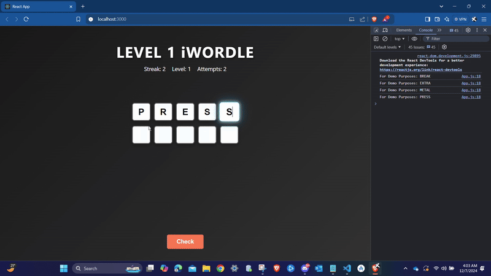

# iGames: UIUC Wordle & Connections Challenge

## Project Overview
iGames is a pair of puzzle-style games inspired by Wordle and the New York Times’ Connections, built with a UIUC theme. Developed as part of the CS124 Honors program at the University of Illinois Urbana-Champaign, the games increase in difficulty as users progress and were designed to reinforce programming logic and problem-solving skills in an engaging way.

## Purpose
These games help players test their pattern recognition, word association, and memory through custom gameplay mechanics tailored to the UIUC environment. iGames is also designed to introduce algorithmic thinking in a gamified setting.

## My Role
I developed the game logic in Python and enhanced the user experience through interface improvements and progressive difficulty scaling. I also implemented custom word lists, scoring systems, and mechanics that differentiate each challenge while maintaining a smooth and intuitive flow.

## Tech Stack
- Languages: Python, JavaScript
- Frameworks: React (for UI)
- Tools: CS124 Honors internal tools and modules

## Future Work
Plans include deploying the games to a hosted frontend, adding level tracking, and expanding the Connections logic to support themed categories and hints.

## Note
Due to course intellectual property policies, the source code for this project cannot be shared publicly.
